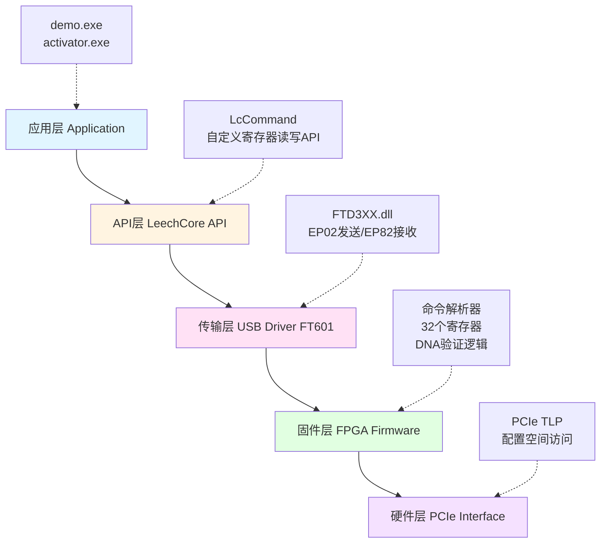

# PCILeech 自定义寄存器通信系统 - 架构与通信原理

**项目版本**: v1.0
**最后更新**: 2025-11-29
**文档目的**: 详细阐述 PCILeech FPGA 自定义寄存器系统的架构设计与软硬件通信原理

---

## 目录

1. [项目概述](#1-项目概述)
2. [系统架构](#2-系统架构)
3. [软硬件通信机制](#3-软硬件通信机制)
4. [软件端工作原理](#4-软件端工作原理)
5. [硬件端工作原理](#5-硬件端工作原理)
6. [附录A: 寄存器映射表](#附录a-寄存器映射表)
7. [附录B: 命令协议速查表](#附录b-命令协议速查表)

---

## 1. 项目概述

### 1.1 核心特性

本项目是 PCILeech FPGA 自定义寄存器通信系统的实现，专注于核心的 DNA 安全验证与寄存器通信功能。

**寄存器架构 (32个寄存器)**
- 通用自定义寄存器: 0-23 (24个) - 用户完全自由使用
- DNA 验证寄存器: 24-31 (8个) - FPGA 硬件 DNA 安全验证通信

**双向通信链路**
```
软件程序 <-> LeechCore API <-> 自定义寄存器 <-> FPGA 逻辑
```
- 读取操作: 软件通过 API 读取 FPGA 寄存器状态
- 写入操作: 软件通过 API 写入控制 FPGA 行为
- DNA 验证: 基于 57 位 FPGA DNA 的硬件身份认证

**DNA 验证系统**

FPGA 固件中的 DNA 验证寄存器分配:
- Register 24: DNA 值低 32 位（只读）
- Register 25: DNA 值高 25 位（只读）
- Register 26: FPGA 生成的加密随机值（只读）
- Register 27: 软件写入的解密结果（写入）
- Register 28: 验证状态 (0=失败, 1=成功)（只读）
- Register 29: TLP 控制状态 (0=禁用, 1=启用)（只读）
- Register 30: 控制命令 (1=开始验证)（写入）
- Register 31: 系统状态（只读）

### 1.2 技术栈

**硬件层**
- FPGA 芯片: Xilinx Artix-7 系列 (35T/75T/100T)
- PCIe 接口: Gen2 x1 物理接口
- USB 芯片: FTDI FT601 (USB 3.0, 最高 400MB/s)

**软件层**
- 通信库: LeechCore API (定制扩展版)
- 驱动: FTD3XX.dll (FT601 USB 驱动)
- 开发环境: Visual Studio 2022, Vivado 2018.3+

**固件层**
- 硬件描述语言: SystemVerilog
- 自定义寄存器: 32 个 32 位寄存器
- DNA 验证逻辑: XOR 加密算法 + 状态机

---

## 2. 系统架构

### 2.1 分层架构

本系统采用五层架构设计，从上到下分别是：



**层级职责说明:**

1. **应用层 (Application Layer)**
   - 用户程序: demo.exe (API 使用示例), activator.exe (DNA 激活器)
   - 职责: 调用 LeechCore API 进行寄存器读写操作

2. **API层 (LeechCore API Layer)**
   - 核心函数: `LcCommand()`, `LcCreateEx()`, `LcClose()`
   - 职责: 将用户请求转换为 64 位命令包，封装底层 USB 通信细节

3. **传输层 (USB Transport Layer)**
   - USB 芯片: FT601 (USB 3.0, 245 FIFO 模式)
   - 管道: EP02 (Host→FPGA), EP82 (FPGA→Host)
   - 职责: 高速 USB 3.0 数据传输

4. **固件层 (FPGA Firmware Layer)**
   - 核心模块: 命令解析器、寄存器系统、DNA 验证状态机
   - 职责: 解析命令、读写寄存器、执行 DNA 验证

5. **硬件层 (PCIe Hardware Layer)**
   - 物理接口: PCIe Gen2 x1
   - 职责: 与目标主机 PCIe 总线交互

### 2.2 数据流向

**读寄存器流程:**
```
[软件] 调用 read_custom_register(reg_num)
   |
   v
[API] 构建 64 位命令包 (READ | reg_num | MAGIC 0x77)
   |
   v
[USB] FT_WritePipe(EP02, cmd_packet) -> FPGA
   |
   v
[FPGA] 命令解析器验证魔术字节 -> 读取寄存器值
   |
   v
[FPGA] 生成 32 字节响应包 (状态字 + 数据)
   |
   v
[USB] FT_ReadPipe(EP82, response) <- FPGA
   |
   v
[API] 解析响应包 -> 提取寄存器值
   |
   v
[软件] 返回寄存器值
```

**写寄存器流程:**
```
[软件] 调用 write_custom_register(reg_num, value)
   |
   v
[API] 构建 64 位命令包 (WRITE | value | MASK | reg_num | MAGIC)
   |
   v
[USB] FT_WritePipe(EP02, cmd_packet) -> FPGA
   |
   v
[FPGA] 命令解析器验证魔术字节 -> 写入寄存器
   |
   v
[软件] 写入完成（可选择等待响应确认）
```

### 2.3 模块关系

**项目目录结构与模块依赖:**
```
pcileech-custom-com/
├── firmware/                  # FPGA 固件模块
│   └── pcileech_fifo.sv      # 核心逻辑: 寄存器系统 + DNA 验证
├── software/
│   └── LeechCore-master/      # 通信库（定制扩展版）
│       └── leechcore/
│           └── device_fpga.c  # 自定义命令 API 实现
└── demo/                      # 演示程序目录
    ├── ACTIVATOR_DEMO/        # DNA 验证激活器
    │   ├── src/
    │   │   ├── main.c        # 5 步骤激活流程
    │   │   ├── leech_api.c   # LeechCore API 封装
    │   │   └── dna_crypto.c  # DNA 加密算法（XOR）
    │   └── includes/
    │       └── leech_api.h   # 寄存器常量定义 (24-31)
    └── CUSTOMREGS_DEMO/       # 自定义寄存器示例
        └── demo.c             # 完整的寄存器读写演示
```

**模块依赖关系:**
- `CUSTOMREGS_DEMO/demo.exe` 依赖 `LeechCore.dll` (自定义寄存器 API)
- `ACTIVATOR_DEMO/activator.exe` 依赖 `LeechCore.dll` + `FTD3XX.dll`
- `LeechCore.dll` 依赖 `FTD3XX.dll` (USB 驱动)
- FPGA 固件独立编译，烧录到 FPGA 设备

---

## 3. 软硬件通信机制

### 3.1 USB 通信层

**FT601 芯片特性**

| 特性 | 参数 |
|-----|------|
| USB 标准 | USB 3.0 SuperSpeed |
| 最大带宽 | 400 MB/s (双向合计) |
| 工作模式 | 245 同步 FIFO 模式 |
| 数据宽度 | 32 位 |
| 发送管道 | EP02 (Host → FPGA) |
| 接收管道 | EP82 (FPGA → Host) |
| 缓冲区 | 硬件 FIFO 缓冲 |

**USB 管道配置**

在 LeechCore 初始化时，FT601 芯片被配置为以下参数:
```c
// 芯片配置
FT_CHIP_CONFIGURATION ChipCfg = {
    .OptionalFeatureSupport = 0x122,  // FIFO 模式
    .FIFOMode = 0x01,                  // 245 模式
    .ChannelConfig = 0x00,             // 4 通道配置
    .PowerSaveEnable = 0               // 禁用省电
};

// 管道超时设置
FT_SetPipeTimeout(hFTDI, 0x02, 100);  // EP02: 100ms 超时
FT_SetPipeTimeout(hFTDI, 0x82, 100);  // EP82: 100ms 超时
```

### 3.2 命令协议格式

**64 位命令包结构**

每个命令都是 64 位（8 字节）的数据包，按照以下格式组织:

```
位 63                                                          0
  ┌────────┬────────┬────────┬────────┬────────┬────────┬────────┬────────┐
  │ DATA   │ DATA   │ MASK   │ MASK   │ ADDR   │ ADDR   │ TYPE   │ MAGIC  │
  │ [63:56]│ [55:48]│ [47:40]│ [39:32]│ [31:24]│ [23:16]│ [15:8] │ [7:0]  │
  └────────┴────────┴────────┴────────┴────────┴────────┴────────┴────────┘
    字节7    字节6    字节5    字节4    字节3    字节2    字节1    字节0
```

**字段详解:**

1. **MAGIC [7:0]**: 魔术字节（必须是 `0x77`）
   - 用于命令包验证，FPGA 会丢弃魔术字节错误的包

2. **TYPE [15:8]**: 命令类型和目标
   - 高 4 位 [15:12]: 命令类型
     - `0001` (1): READ - 读操作
     - `0010` (2): WRITE - 写操作
     - `0100` (4): CUSTOM_READ - 自定义读（本项目使用）
     - `1000` (8): CUSTOM_WRITE - 自定义写（本项目使用）
   - 低 4 位 [11:8]: 目标选择
     - `0001` (1): PCIe 配置空间
     - `0011` (3): FPGA 核心寄存器
     - `0101` (5): PHY 寄存器

3. **ADDRESS [31:16]**: 16 位地址（大端序）
   - bit[15]: R/W 标志（1=可写寄存器，0=只读寄存器）
   - bit[14]: Shadow 配置空间标志
   - bit[13:0]: 实际地址

4. **MASK [47:32]**: 16 位掩码（小端序）
   - 写操作: 指定要写入的位（1=写入，0=保持）
   - 读操作: 不使用（填 0）

5. **DATA [63:48]**: 16 位数据（小端序）
   - 写操作: 要写入的数据
   - 读操作: 不使用（填 0）

**命令示例:**

读取寄存器 0:
```
字节排列: 0x77 0x04 0x00 0x00  0x00 0x00 0x00 0x00
           │    │    │地址0│  │    │    │不使用│
           │    └─── READ(4) | 无目标选择
           └─────── 魔术字节 0x77
```

写入寄存器 5，值 0x12345678:
```
字节排列: 0x77 0x08 0x00 0x05  0xFF 0xFF 0x78 0x56
           │    │    │地址5│  │掩码  │  数据  │
           │    └─── WRITE(8) | 无目标选择
           └─────── 魔术字节 0x77

注意: 数据字段采用小端序，0x12345678 实际发送为 0x78 0x56 (只取低16位)
```

### 3.3 响应包格式

**32 字节响应结构**

FPGA 返回的响应包格式:
```
32 位状态字 + 7 个 32 位数据字 = 256 位（32 字节）

字节偏移:
0-3:   状态字 (Status Word)
4-7:   数据字 1 (Data Word 1)
8-11:  数据字 2 (Data Word 2)
...
28-31: 数据字 7 (Data Word 7)
```

**状态字格式:**
```
位 31                                                           0
  ┌────┬────┬────┬────┬────┬────┬────┬────┐
  │ E  │ S7 │ S6 │ S5 │ S4 │ S3 │ S2 │ S1 │
  └────┴────┴────┴────┴────┴────┴────┴────┘
   [31:28] [27:24] [23:20] [19:16] [15:12] [11:8] [7:4] [3:0]

- E (bits 31:28): 必须是 0xE（标识符）
- S1-S7 (每个 4 位): 对应 7 个数据字的状态
  - 状态值表示数据来源（PCIe=1, CORE=3, PHY=5 等）
```

**数据字格式:**
```
位 31                              0
  ┌────────────────┬────────────────┐
  │  数据 (16位)   │  地址 (16位)   │
  └────────────────┴────────────────┘
   [31:16]          [15:0]

- 地址字段: 大端序，表示寄存器地址
- 数据字段: 小端序，表示寄存器值（需要字节交换）
```

### 3.4 通信流程

**读寄存器完整时序:**

```
主机                     USB                      FPGA
 │                       │                        │
 ├─ 调用 read_register(0) ────────────────────────>│
 │                       │                        │
 │                  [构建 64 位命令包]              │
 │  0x77 0x04 0x00 0x00 0x00 0x00 0x00 0x00      │
 │                       │                        │
 ├────── WritePipe ─────>├───── EP02 ──────────>│
 │       (EP02, 8字节)   │                        │
 │                       │                   [验证魔术字节]
 │                       │                   [解析命令类型 READ]
 │                       │                   [读取寄存器 0]
 │                       │                   [生成响应包 32字节]
 │                       │                        │
 │                    [等待 10ms]                 │
 │                       │                        │
 ├────── ReadPipe ──────<├───── EP82 ──────────<│
 │       (EP82)          │   [状态字 + 数据]     │
 │                       │                        │
 │                  [解析响应]                     │
 │                  [提取寄存器值]                 │
 │                       │                        │
 ├─ 返回值 ───────────────────────────────────────>│
```

**DNA 验证流程 (5 步骤):**

```
步骤 1: 读取 DNA 值
  Host -> FPGA: READ 寄存器 24 (DNA 低 32 位)
  Host -> FPGA: READ 寄存器 25 (DNA 高 25 位)
  Host <- FPGA: 响应包，返回 DNA 值

步骤 2: 启动验证流程
  Host -> FPGA: WRITE 寄存器 30 = 1 (控制命令)
  FPGA: 启动 DNA 验证状态机

步骤 3: 等待固件准备就绪
  Host -> FPGA: READ 寄存器 31 (系统状态)
  Host <- FPGA: 响应包，状态 = 1 (处理中) 或 2 (就绪)
  [轮询直到就绪，最多 5 秒超时]

步骤 4: 读取加密值并解密
  Host -> FPGA: READ 寄存器 26 (FPGA 生成的加密随机值)
  Host <- FPGA: 响应包，返回加密值
  Host: 执行 XOR 解密算法 (使用 DNA 值)
  Host -> FPGA: WRITE 寄存器 27 = 解密结果

步骤 5: 验证结果
  Host -> FPGA: READ 寄存器 28 (验证状态)
  Host <- FPGA: 响应包，1=成功, 0=失败
  Host -> FPGA: READ 寄存器 29 (TLP 控制状态)
  Host <- FPGA: 响应包，1=TLP 已启用
```

---

## 4. 软件端工作原理

### 4.1 LeechCore API 层

**命令构建核心逻辑**

LeechCore 的 `DeviceFPGA_ConfigRead` 函数负责构建读命令:

```c
// 核心代码片段: 读取自定义寄存器
BOOL DeviceFPGA_ConfigRead(ctx, wBaseAddr, pb, cb, flags) {
    BYTE pbRxTx[0x20000];
    DWORD cbRxTx = 0;

    // 构建读命令（每次读取 2 字节）
    for (wAddr = wBaseAddr & 0xfffe; wAddr < wBaseAddr + cb; wAddr += 2) {
        pbRxTx[cbRxTx + 0] = 0x00;                        // DATA 低字节
        pbRxTx[cbRxTx + 1] = 0x00;                        // DATA 高字节
        pbRxTx[cbRxTx + 2] = 0x00;                        // MASK 低字节
        pbRxTx[cbRxTx + 3] = 0x00;                        // MASK 高字节
        pbRxTx[cbRxTx + 4] = (wAddr | (flags & 0xC000)) >> 8;  // 地址高字节
        pbRxTx[cbRxTx + 5] = wAddr & 0xff;                // 地址低字节
        pbRxTx[cbRxTx + 6] = 0x10 | (flags & 0x03);      // READ | 目标
        pbRxTx[cbRxTx + 7] = 0x77;                        // 魔术字节
        cbRxTx += 8;

        // 批量发送优化（避免频繁 USB 传输）
        if (cbRxTx >= 0x3f0) {
            FT_WritePipe(hFTDI, 0x02, pbRxTx, cbRxTx, &cbTX, NULL);
            cbRxTx = 0;
        }
    }

    // 发送剩余命令
    if (cbRxTx) {
        FT_WritePipe(hFTDI, 0x02, pbRxTx, cbRxTx, &cbTX, NULL);
    }

    Sleep(10);  // 等待 FPGA 处理

    // 读取响应
    FT_ReadPipe(hFTDI, 0x82, pbRxTx, 0x20000, &cbRX, NULL);

    // 解析响应...（见下节）
}
```

**响应解析核心逻辑**

```c
// 核心代码片段: 解析 FPGA 响应包
for (i = 0; i < cbRX; i += 32) {
    // 跳过 FTDI 填充数据（同步字节）
    while (*(PDWORD)(pbRX + i) == 0x55556666) {
        i += 4;
        if (i + 32 > cbRX) return FALSE;
    }

    // 读取状态字
    dwStatus = *(PDWORD)(pbRX + i);
    pdwData = (PDWORD)(pbRX + i + 4);

    // 验证状态字（高 4 位必须是 0xE）
    if ((dwStatus & 0xf0000000) != 0xe0000000) continue;

    // 处理 7 个数据字
    for (j = 0; j < 7; j++) {
        // 检查状态位是否匹配请求的目标
        if ((dwStatus & 0x0f) == (flags & 0x03)) {
            dwData = *pdwData;

            // 提取地址（高 16 位，大端序）
            wAddr = _byteswap_ushort((WORD)dwData);

            // 提取数据（低 16 位，小端序，需要字节交换）
            wData = _byteswap_ushort((WORD)(dwData >> 16));

            // 存储到结果缓冲区
            if (wAddr >= wBaseAddr && wAddr < wBaseAddr + cb) {
                *(PWORD)(pb + wAddr - wBaseAddr) = wData;
            }
        }

        pdwData++;      // 下一个数据字
        dwStatus >>= 4;  // 下一个状态位
    }
}
```

### 4.2 应用程序层

**DNA 激活流程（5 步骤简要说明）**

`activator.exe` 程序执行以下步骤:

```
步骤 1: 连接 FPGA 设备
  - 调用 init_leechcore("fpga")
  - 初始化 FT601 USB 连接
  - 获取 FPGA 版本信息

步骤 2: 读取 FPGA DNA 值
  - 调用 read_dna_value(hLC)
  - 读取寄存器 24-25
  - 组合为 57 位 DNA 值

步骤 3: 执行 DNA 验证
  - 启动验证: write_register(hLC, 30, 1)
  - 等待就绪: 轮询寄存器 31
  - 读取加密值: read_register(hLC, 26)
  - 解密: decrypted = dna_decrypt(encrypted, dna_value)
  - 写入结果: write_register(hLC, 27, decrypted)
  - 等待验证完成: 轮询寄存器 28

步骤 4: 检查 TLP 控制状态
  - 调用 check_tlp_control_status(hLC)
  - 读取寄存器 29
  - 确认 TLP 已启用 (值为 1)

步骤 5: 激活成功
  - 显示激活摘要（DNA 值、TLP 状态）
  - 此时可以访问寄存器 0-23
```

**自定义寄存器读写 API 调用示例**

```c
#include "leechcore.h"

// 自定义命令定义
#define LC_CMD_FPGA_CUSTOM_READ_REG(n)  (0x0200000000000000ULL | ((n) & 0xFF))
#define LC_CMD_FPGA_CUSTOM_WRITE_REG(n) (0x0201000000000000ULL | ((n) & 0xFF))

// 读取寄存器
BOOL read_custom_register(HANDLE hLC, BYTE regNum, DWORD* pValue) {
    PBYTE pbDataOut = NULL;
    DWORD cbDataOut = 0;

    BOOL result = LcCommand(
        hLC,
        LC_CMD_FPGA_CUSTOM_READ_REG(regNum),
        0, NULL,
        &pbDataOut, &cbDataOut
    );

    if (result && pbDataOut && cbDataOut == sizeof(DWORD)) {
        *pValue = *(PDWORD)pbDataOut;
        LocalFree(pbDataOut);
        return TRUE;
    }
    return FALSE;
}

// 写入寄存器
BOOL write_custom_register(HANDLE hLC, BYTE regNum, DWORD value) {
    return LcCommand(
        hLC,
        LC_CMD_FPGA_CUSTOM_WRITE_REG(regNum),
        sizeof(DWORD), (PBYTE)&value,
        NULL, NULL
    );
}

// 使用示例
int main() {
    HANDLE hLC = LcCreateEx(&cfg, NULL);

    // 写入寄存器 0
    write_custom_register(hLC, 0, 0x12345678);

    // 读取寄存器 0
    DWORD value;
    read_custom_register(hLC, 0, &value);
    printf("寄存器 0 = 0x%08X\n", value);

    LcClose(hLC);
    return 0;
}
```

---

## 5. 硬件端工作原理

### 5.1 FPGA 数据路径

**USB 到寄存器的数据流:**

```
USB 接收 (32位) -> FIFO_32_32 -> FIFO_64_64 -> 命令解析器 -> 寄存器/PCIe
                                                   │
                                                   v
USB 发送 (32位) <- FIFO_32_32 <- FIFO_64_64 <- 响应生成器
```

**关键模块:**

1. **32 位到 64 位转换 FIFO**
   - 将 USB 的 32 位数据流组合为 64 位命令包
   - 缓冲不对齐的数据边界

2. **命令接收 FIFO** (`fifo_cmd_rx`)
   - 存储待处理的 64 位命令包
   - 深度: 通常 1024 条目

3. **命令解析器** (状态机)
   - 验证魔术字节 (0x77)
   - 解析命令类型 (READ/WRITE)
   - 路由到对应的目标模块

4. **响应生成器**
   - 组装 32 字节响应包
   - 填充状态字和数据字

5. **64 位到 32 位转换 FIFO**
   - 将 64 位响应拆分为 32 位数据流
   - 发送回 USB

### 5.2 命令解析器逻辑

**SystemVerilog 核心片段:**

```systemverilog
// 命令接收与验证
wire cmd_rx_valid = ~cmd_rx_empty && rd_cmd_enable;
wire [63:0] cmd_rx_dout;

// 魔术字节验证
wire cmd_magic_valid = (cmd_rx_dout[7:0] == 8'h77);

// 命令类型解析
wire in_cmd_read  = cmd_rx_valid && cmd_magic_valid && cmd_rx_dout[12];  // bit 12 = READ
wire in_cmd_write = cmd_rx_valid && cmd_magic_valid && cmd_rx_dout[13];  // bit 13 = WRITE

// 地址提取（大端序）
wire [15:0] in_cmd_address_byte = {cmd_rx_dout[23:16], cmd_rx_dout[31:24]};

// 数据提取（小端序）
wire [15:0] in_cmd_value = {cmd_rx_dout[55:48], cmd_rx_dout[63:56]};

// 命令类型路由
always @(posedge clk) begin
    if (in_cmd_read) begin
        // 读操作: 根据地址读取寄存器或配置空间
        case (cmd_rx_dout[11:8])  // 目标选择
            4'b0001: // PCIe 配置空间
                pcie_config_read <= 1'b1;
            4'b0011: // FPGA 核心寄存器
                core_reg_read <= 1'b1;
            default:
                // 自定义寄存器读取
                custom_reg_read <= 1'b1;
        endcase
    end

    if (in_cmd_write) begin
        // 写操作: 根据地址写入寄存器
        custom_reg_write <= 1'b1;
    end
end
```

### 5.3 寄存器系统

**32 个寄存器映射**

```systemverilog
// 自定义寄存器数组 (32 个 32 位寄存器)
reg [31:0] custom_registers [0:31];

// 寄存器分组
// 0-23:  通用自定义寄存器（用户自由使用）
// 24-31: DNA 验证寄存器（系统保留）

// 读操作逻辑
wire [4:0] custom_reg_num = in_cmd_address_byte[6:2];  // 5 位地址 (32 个寄存器)
wire in_cmd_custom_read = in_cmd_read && (cmd_rx_dout[11:8] == 4'b0000);

always @(posedge clk) begin
    if (in_cmd_custom_read) begin
        // 读取寄存器值（字节交换以匹配小端序）
        _cmd_tx_din[31:16] <= in_cmd_address_byte;  // 地址（大端序）
        _cmd_tx_din[15:0]  <= {
            custom_registers[custom_reg_num][7:0],
            custom_registers[custom_reg_num][15:8]
        };  // 数据（小端序）
    end
end

// 写操作逻辑
wire in_cmd_custom_write = in_cmd_write && (cmd_rx_dout[11:8] == 4'b0000);

always @(posedge clk) begin
    if (in_cmd_custom_write) begin
        // 根据寄存器编号写入对应寄存器
        // 注意: 寄存器 24-31 有特殊保护逻辑
        if (custom_reg_num < 24) begin
            // 通用寄存器: 直接写入
            custom_registers[custom_reg_num][15:0] <= in_cmd_value;
        end
        else if (custom_reg_num == 27) begin
            // 寄存器 27: 解密结果寄存器（可写）
            custom_registers[27] <= in_cmd_value;
        end
        else if (custom_reg_num == 30) begin
            // 寄存器 30: 控制命令寄存器（可写）
            custom_registers[30] <= in_cmd_value;
        end
        // 其他 DNA 寄存器为只读，忽略写入
    end
end
```

### 5.4 DNA 验证状态机

**状态定义与转换:**

```systemverilog
// DNA 验证状态机状态定义
localparam DNA_IDLE           = 3'd0;  // 空闲状态
localparam DNA_WAIT_START     = 3'd1;  // 等待启动命令
localparam DNA_GEN_CHALLENGE  = 3'd2;  // 生成随机挑战值
localparam DNA_WAIT_RESPONSE  = 3'd3;  // 等待软件响应
localparam DNA_VERIFY         = 3'd4;  // 验证解密结果
localparam DNA_SUCCESS        = 3'd5;  // 验证成功
localparam DNA_FAIL           = 3'd6;  // 验证失败

reg [2:0] dna_state;
reg [31:0] challenge_value;      // FPGA 生成的随机值
reg [31:0] expected_response;    // 预期的解密结果
reg [56:0] fpga_dna;             // FPGA DNA 值（57 位）

// DNA 验证状态机
always @(posedge clk) begin
    if (rst) begin
        dna_state <= DNA_IDLE;
        custom_registers[28] <= 32'h0;  // 验证状态 = 失败
        custom_registers[29] <= 32'h0;  // TLP 控制 = 禁用
    end
    else begin
        case (dna_state)
            DNA_IDLE: begin
                // 读取 FPGA DNA 值
                fpga_dna <= DNA_PORT;
                custom_registers[24] <= fpga_dna[31:0];   // DNA 低 32 位
                custom_registers[25] <= {7'b0, fpga_dna[56:32]};  // DNA 高 25 位
                dna_state <= DNA_WAIT_START;
            end

            DNA_WAIT_START: begin
                // 等待寄存器 30 写入 1（启动验证）
                if (custom_registers[30] == 32'h1) begin
                    dna_state <= DNA_GEN_CHALLENGE;
                end
            end

            DNA_GEN_CHALLENGE: begin
                // 生成随机挑战值（使用 LFSR 或硬件随机数生成器）
                challenge_value <= $random;
                custom_registers[26] <= challenge_value;  // 写入寄存器 26

                // 计算预期响应（XOR 加密）
                expected_response <= dna_encrypt(challenge_value, fpga_dna);

                custom_registers[31] <= 32'h1;  // 系统状态 = 处理中
                dna_state <= DNA_WAIT_RESPONSE;
            end

            DNA_WAIT_RESPONSE: begin
                custom_registers[31] <= 32'h2;  // 系统状态 = 就绪

                // 等待软件写入解密结果到寄存器 27
                if (custom_registers[27] != 32'h0) begin
                    dna_state <= DNA_VERIFY;
                end
            end

            DNA_VERIFY: begin
                // 验证解密结果
                if (custom_registers[27] == expected_response) begin
                    dna_state <= DNA_SUCCESS;
                end
                else begin
                    dna_state <= DNA_FAIL;
                end
            end

            DNA_SUCCESS: begin
                custom_registers[28] <= 32'h1;  // 验证状态 = 成功
                custom_registers[29] <= 32'h1;  // TLP 控制 = 启用
                // 保持成功状态，允许访问通用寄存器
            end

            DNA_FAIL: begin
                custom_registers[28] <= 32'h0;  // 验证状态 = 失败
                custom_registers[29] <= 32'h0;  // TLP 控制 = 禁用
                // 返回等待状态，允许重试
                dna_state <= DNA_WAIT_START;
            end
        endcase
    end
end

// DNA 加密函数（XOR 算法）
function [31:0] dna_encrypt;
    input [31:0] data;
    input [56:0] dna;
    begin
        dna_encrypt = dna[31:0] ^ (dna[56:32] << 7) ^ data;
    end
endfunction
```

---

## 附录A: 寄存器映射表

### 完整的 32 个寄存器说明

| 寄存器编号 | 地址偏移 | 名称 | 读写属性 | 用途说明 |
|-----------|---------|------|---------|---------|
| 0 | 0x00 | CUSTOM_REG_0 | 读写 | 通用自定义寄存器 |
| 1 | 0x04 | CUSTOM_REG_1 | 读写 | 通用自定义寄存器 |
| 2 | 0x08 | CUSTOM_REG_2 | 读写 | 通用自定义寄存器 |
| 3 | 0x0C | CUSTOM_REG_3 | 读写 | 通用自定义寄存器 |
| 4 | 0x10 | CUSTOM_REG_4 | 读写 | 通用自定义寄存器 |
| 5 | 0x14 | CUSTOM_REG_5 | 读写 | 通用自定义寄存器 |
| 6 | 0x18 | CUSTOM_REG_6 | 读写 | 通用自定义寄存器 |
| 7 | 0x1C | CUSTOM_REG_7 | 读写 | 通用自定义寄存器 |
| 8 | 0x20 | CUSTOM_REG_8 | 读写 | 通用自定义寄存器 |
| 9 | 0x24 | CUSTOM_REG_9 | 读写 | 通用自定义寄存器 |
| 10 | 0x28 | CUSTOM_REG_10 | 读写 | 通用自定义寄存器 |
| 11 | 0x2C | CUSTOM_REG_11 | 读写 | 通用自定义寄存器 |
| 12 | 0x30 | CUSTOM_REG_12 | 读写 | 通用自定义寄存器 |
| 13 | 0x34 | CUSTOM_REG_13 | 读写 | 通用自定义寄存器 |
| 14 | 0x38 | CUSTOM_REG_14 | 读写 | 通用自定义寄存器 |
| 15 | 0x3C | CUSTOM_REG_15 | 读写 | 通用自定义寄存器 |
| 16 | 0x40 | CUSTOM_REG_16 | 读写 | 通用自定义寄存器 |
| 17 | 0x44 | CUSTOM_REG_17 | 读写 | 通用自定义寄存器 |
| 18 | 0x48 | CUSTOM_REG_18 | 读写 | 通用自定义寄存器 |
| 19 | 0x4C | CUSTOM_REG_19 | 读写 | 通用自定义寄存器 |
| 20 | 0x50 | CUSTOM_REG_20 | 读写 | 通用自定义寄存器 |
| 21 | 0x54 | CUSTOM_REG_21 | 读写 | 通用自定义寄存器 |
| 22 | 0x58 | CUSTOM_REG_22 | 读写 | 通用自定义寄存器 |
| 23 | 0x5C | CUSTOM_REG_23 | 读写 | 通用自定义寄存器 |
| 24 | 0x60 | DNA_VALUE_LOW | 只读 | FPGA DNA 值低 32 位 |
| 25 | 0x64 | DNA_VALUE_HIGH | 只读 | FPGA DNA 值高 25 位（bit[24:0] 有效） |
| 26 | 0x68 | ENCRYPTED_CHALLENGE | 只读 | FPGA 生成的加密随机值 |
| 27 | 0x6C | DECRYPTED_RESPONSE | 写入 | 软件写入的解密结果 |
| 28 | 0x70 | VERIFY_STATUS | 只读 | DNA 验证状态 (0=失败, 1=成功) |
| 29 | 0x74 | TLP_CONTROL_STATUS | 只读 | TLP 控制状态 (0=禁用, 1=启用) |
| 30 | 0x78 | CONTROL_COMMAND | 写入 | 控制命令 (1=开始验证) |
| 31 | 0x7C | SYSTEM_STATUS | 只读 | 系统状态 (0=空闲, 1=处理中, 2=就绪) |

### 寄存器使用注意事项

**通用寄存器 (0-23)**
- 需要 DNA 激活后才能正常读写
- 未激活时访问可能返回全 0 或失败
- 用户可自由定义用途（配置参数、状态标志、数据缓冲等）

**DNA 验证寄存器 (24-31)**
- 可在 DNA 激活前读取
- 但 TLP 功能需要激活后才可用
- 寄存器 24-26, 28-29, 31 为只读，写入无效
- 寄存器 27, 30 为写入寄存器

---

## 附录B: 命令协议速查表

### 命令类型定义

| 命令类型 | 位值 [15:12] | 十进制 | 说明 |
|---------|-------------|-------|------|
| READ | 0001 | 1 | 读操作 |
| WRITE | 0010 | 2 | 写操作 |
| (保留) | 0011 | 3 | 保留 |
| CUSTOM_READ | 0100 | 4 | 自定义读（本项目使用） |
| (保留) | 0101-0111 | 5-7 | 保留 |
| CUSTOM_WRITE | 1000 | 8 | 自定义写（本项目使用） |
| (保留) | 1001-1111 | 9-15 | 保留 |

### 目标选择定义

| 目标 | 位值 [11:8] | 十进制 | 说明 |
|-----|------------|-------|------|
| PCIe 配置空间 | 0001 | 1 | PCIe Configuration Space |
| (保留) | 0010 | 2 | 保留 |
| FPGA 核心寄存器 | 0011 | 3 | FPGA Core Registers |
| (保留) | 0100 | 4 | 保留 |
| PHY 寄存器 | 0101 | 5 | PHY Registers |
| (保留) | 0110-1111 | 6-15 | 保留 |

### 完整命令示例

**读取自定义寄存器 0:**
```
字节序列: 0x77 0x04 0x00 0x00  0x00 0x00 0x00 0x00
          └─┬─┘ └─┬─┘ └───┬───┘  └───────┬───────┘
         MAGIC  TYPE   地址 0      DATA/MASK (未使用)

TYPE 字段详解:
  0x04 = 0000 0100 (二进制)
         ^^^^ ^^^^
         │    └──── 目标选择 = 0 (自定义寄存器)
         └────────── 命令类型 = 4 (CUSTOM_READ)
```

**写入自定义寄存器 5，值 0xDEADBEEF:**
```
字节序列: 0x77 0x08 0x00 0x05  0xFF 0xFF 0xEF 0xBE
          └─┬─┘ └─┬─┘ └───┬───┘  └───┬───┘ └───┬───┘
         MAGIC  TYPE   地址 5      MASK    DATA (小端序)

TYPE 字段详解:
  0x08 = 0000 1000 (二进制)
         ^^^^ ^^^^
         │    └──── 目标选择 = 0 (自定义寄存器)
         └────────── 命令类型 = 8 (CUSTOM_WRITE)

DATA 字段: 0xDEADBEEF 以小端序存储
  原始值: 0xDEADBEEF
  低 16 位: 0xBEEF
  字节序: 0xEF 0xBE (小端序)
```

**读取 FPGA 核心寄存器 (地址 0x0008):**
```
字节序列: 0x77 0x13 0x00 0x08  0x00 0x00 0x00 0x00
          └─┬─┘ └─┬─┘ └───┬───┘  └───────┬───────┘
         MAGIC  TYPE   地址 8      DATA/MASK (未使用)

TYPE 字段详解:
  0x13 = 0001 0011 (二进制)
         ^^^^ ^^^^
         │    └──── 目标选择 = 3 (FPGA 核心寄存器)
         └────────── 命令类型 = 1 (READ)
```

### LeechCore API 自定义命令宏

在 `device_fpga.c` 中定义的宏:

```c
// 自定义寄存器读写命令（用于本项目）
#define LC_CMD_FPGA_CUSTOM_READ_REG(n)   (0x0200000000000000ULL | ((n) & 0xFF))
#define LC_CMD_FPGA_CUSTOM_WRITE_REG(n)  (0x0201000000000000ULL | ((n) & 0xFF))

// 宏展开示例:
// LC_CMD_FPGA_CUSTOM_READ_REG(5)
//   = 0x0200000000000000 | 0x05
//   = 0x0200000000000005
//
// 对应的命令包字节序列:
//   0x05 0x00 0x00 0x00 0x00 0x00 0x00 0x02
//   └─┬─┘ └───────┬───────┘ └───────┬───────┘
//   寄存器号      保留         命令标识
```

---

**文档结束**

本文档详细阐述了 PCILeech 自定义寄存器通信系统的架构设计与通信原理。如需更多实现细节，请参考：
- `README.md` - 项目总览与文档导航
- `demo/README.md` - 演示程序总览
- `demo/ACTIVATOR_DEMO/README.md` - DNA 激活器使用指南
- `demo/CUSTOMREGS_DEMO/README.md` - 自定义寄存器使用示例
